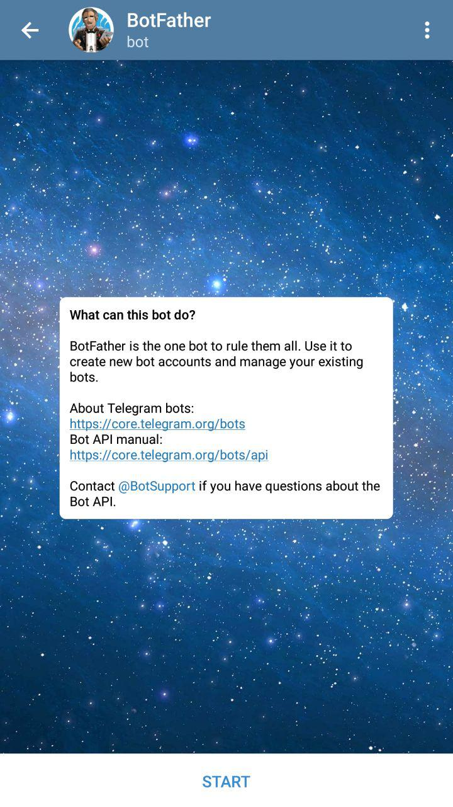
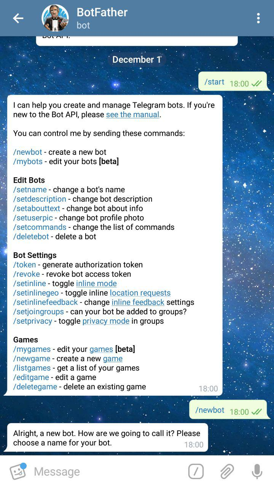
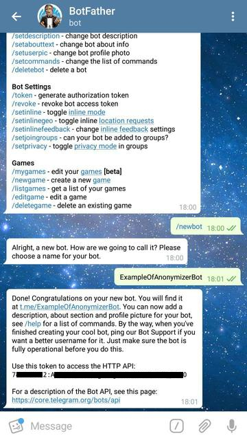
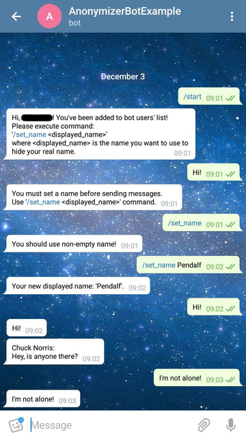
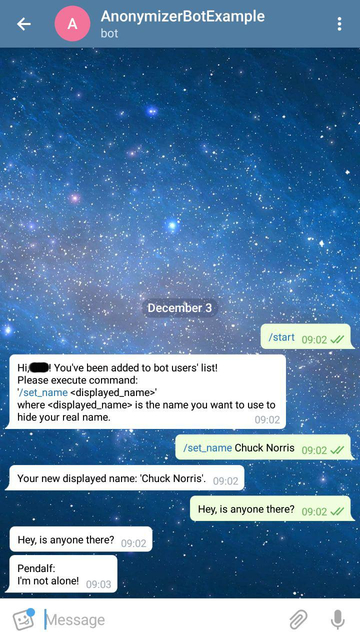

Каждый разработчик (и не только), который использует Telegram в повседневной жизни, хотя бы раз задумывался о том,
каково это - создать своего бота, на сколько это сложно и какой язык программирования лучше использовать?

На все эти вопросы могу дать самый простой (и, наверно, самый правильный) ответ: все зависит от вас самих, ваших знаний и намерений.

...Но в этой небольшой статье, я покажу, как можно создать своего бота на языке Java и что это довольно интересно и несложно.

Мы будем использовать [библиотеку для работы с Telegram Bots API](https://github.com/rubenlagus/TelegramBots)
и ее [расширение](https://github.com/rubenlagus/TelegramBots/blob/master/telegrambots-extensions/src/main/java/org/telegram/telegrambots/extensions/bots/commandbot/TelegramLongPollingCommandBot.java),
позволяющее создавать свои команды ('`/custom_cmd`') и обрабатывать их простым способом.

Задачей бота будет являться регистрация пользователя и отправка сообщения от указанного им имени другим пользователям
бота. 

## Создание нового проекта и подготовка
### 1. Добавление зависимостей в проект
Создадим новый maven-проект и отредактируем `pom.xml`, добавив в него необходимые зависимости: 
<details>
    <summary>pom.xml</summary>        
    
```xml
<?xml version="1.0" encoding="UTF-8"?>
<project xmlns="http://maven.apache.org/POM/4.0.0"
         xmlns:xsi="http://www.w3.org/2001/XMLSchema-instance"
         xsi:schemaLocation="http://maven.apache.org/POM/4.0.0 http://maven.apache.org/xsd/maven-4.0.0.xsd">
    <modelVersion>4.0.0</modelVersion>

    <groupId>io.example</groupId>
    <artifactId>anonymizerbot</artifactId>
    <version>1.0-SNAPSHOT</version>

    <build>
        <plugins>
            <plugin>
                <groupId>org.apache.maven.plugins</groupId>
                <artifactId>maven-compiler-plugin</artifactId>
                <configuration>
                    <source>8</source>
                    <target>8</target>
                </configuration>
            </plugin>
        </plugins>
    </build>

    <dependencies>

        <!-- Telegram API -->
        <dependency>
            <groupId>org.telegram</groupId>
            <artifactId>telegrambots</artifactId>
            <version>LATEST</version>
        </dependency>
        <dependency>
            <groupId>org.telegram</groupId>
            <artifactId>telegrambotsextensions</artifactId>
            <version>LATEST</version>
        </dependency>

        ...

    </dependencies>

</project>
``` 
* `Telegram API` - [библиотека для работы с Telegram Bots API](https://github.com/rubenlagus/TelegramBots),
    содержит в себе классы и методы для взаимодействия с сервисами Telegram и некоторые расширения
    этих классов.
</details> 
    
### 2. Создание аккаунта для бота
Для этого нам необходимо обратиться за помощью к боту BotFather:
* найдем бота в поиске; 
* выполним команду `/start`;
* выполним команду `/newbot`; 
* зададим какое-нибудь имя нашему боту (должно заканчиваться на "Bot"). Я назвал его ExampleOfAnonymizerBot. 

После выполнения этих команд мы получим токен, который нам понадобится для использования Bot API.
(`7xxxxxxx2:Axxxxxxxxxxxxxxxxxxxxxxxxxxxxxxxxx0`)




    
## Реализация
### 1. Модель анонимного отправителя сообщений

Данные, необходимые нам от каждого пользователя:
- `User mUser` - информация о пользователе Telegram;
- `Chat mChat` - информация о чате пользователя и бота;
- `String mDisplayedName` - имя, от которого пользователь будет посылать сообщения другим пользователям бота.

<details>
    <summary>Anonymous.java</summary> 
    
```java
package io.example.anonymizerbot.model;

import org.telegram.telegrambots.meta.api.objects.Chat;
import org.telegram.telegrambots.meta.api.objects.User;

public final class Anonymous {

    private final User mUser;
    private final Chat mChat;
    private String mDisplayedName;

    public Anonymous(User user, Chat chat) {
        mUser = user;
        mChat = chat;
    }

    @Override
    public int hashCode() {
        return mUser.hashCode();
    }

    @Override
    public boolean equals(Object obj) {
        return obj instanceof Anonymous && ((Anonymous) obj).getUser().equals(mUser);
    }

    public User getUser() {
        return mUser;
    }

    public Chat getChat() {
        return mChat;
    }

    public String getDisplayedName() {
        return mDisplayedName;
    }

    public void setDisplayedName(String displayedName) {
        mDisplayedName = displayedName;
    }
} 
```
</details> 

</br>

Обернем модель в `Anonymouses`, добавив несколько нужных методов для работы с анонимами:
<details>
    <summary>Anonymouses.java</summary> 
    
```java
package io.example.anonymizerbot.service;

import io.example.anonymizerbot.model.Anonymous;
import org.telegram.telegrambots.meta.api.objects.User;

import java.util.HashSet;
import java.util.Objects;
import java.util.Set;
import java.util.stream.Stream;

public final class AnonymousService {

    private final Set<Anonymous> mAnonymouses;

    public AnonymousService() {
        mAnonymouses = new HashSet<>();
    }

    public boolean setUserDisplayedName(User user, String name) {

        if (!isDisplayedNameTaken(name)) {
            mAnonymouses.stream().filter(a -> a.getUser().equals(user)).forEach(a -> a.setDisplayedName(name));
            return true;
        }

        return false;
    }

    public boolean removeAnonymous(User user) {
        return mAnonymouses.removeIf(a -> a.getUser().equals(user));
    }

    public boolean addAnonymous(Anonymous anonymous) {
        return mAnonymouses.add(anonymous);
    }

    public boolean hasAnonymous(User user) {
        return mAnonymouses.stream().anyMatch(a -> a.getUser().equals(user));
    }

    public String getDisplayedName(User user) {

        Anonymous anonymous = mAnonymouses.stream().filter(a -> a.getUser().equals(user)).findFirst().orElse(null);

        if (anonymous == null) {
            return null;
        }
        return anonymous.getDisplayedName();
    }

    public Stream<Anonymous> anonymouses() {
        return mAnonymouses.stream();
    }

    private boolean isDisplayedNameTaken(String name) {
        return mAnonymouses.stream().anyMatch(a -> Objects.equals(a.getDisplayedName(), name));
    }
} 
``` 
</details>

### 2. Интерфейс бота

Любая кастомная команда должна наследоваться от `BotCommand` и реализовывать метод
`execute(AbsSender sender, User user, Chat chat, String[] strings)`, который используется для обработки команд пользователей.

После того как мы обработаем команду пользователя, мы можем послать ему ответ, используя метод `execute` класса`AbsSender`,
который принимает на вход вышеупомянутый `execute(AbsSender sender, User user, Chat chat, String[] strings)`.

Здесь и далее чтобы не оборачивать каждый раз метод `AbsSender.execute`, который может выбросить исключение `TelegramApiException`,
в `try-catch`, и для того чтобы не прописывать в каждой команде вывод однообразных логов,
создадим класс `AnonymizerCommand`, а наши кастомные команды будем уже наследовать от него (обработку исключений в этом примере оставим):

<details>
    <summary>AnonymizerCommand.java</summary>
    
```java
package io.example.anonymizerbot.command;

import io.example.anonymizerbot.logger.LogLevel;
import io.example.anonymizerbot.logger.LogTemplate;
import org.apache.logging.log4j.Level;
import org.apache.logging.log4j.Logger;
import org.apache.logging.log4j.LogManager;
import org.telegram.telegrambots.extensions.bots.commandbot.commands.BotCommand;
import org.telegram.telegrambots.meta.api.methods.send.SendMessage;
import org.telegram.telegrambots.meta.api.objects.User;
import org.telegram.telegrambots.meta.bots.AbsSender;
import org.telegram.telegrambots.meta.exceptions.TelegramApiException;

abstract class AnonymizerCommand extends BotCommand {

    final Logger log = LogManager.getLogger(getClass());

    AnonymizerCommand(String commandIdentifier, String description) {
        super(commandIdentifier, description);
    }

    void execute(AbsSender sender, SendMessage message, User user) {
        try {
            sender.execute(message);
            log.log(Level.getLevel(LogLevel.SUCCESS.getValue()), LogTemplate.COMMAND_SUCCESS.getTemplate(), user.getId(), getCommandIdentifier());
        } catch (TelegramApiException e) {
            log.error(LogTemplate.COMMAND_EXCEPTION.getTemplate(), user.getId(), getCommandIdentifier(), e);
        }
    }
} 
``` 
</details>

</br> 

Определим команды, на которые наш бот будет реагировать:
- `/start` - создаст нового `Anonymous` без имени и добавит его в коллекцию `Anonymouses`;
<details>
    <summary>StartCommand.java</summary>
    
```java
package io.example.anonymizerbot.command;

import io.example.anonymizerbot.logger.LogLevel;
import io.example.anonymizerbot.logger.LogTemplate;
import io.example.anonymizerbot.model.Anonymous;
import io.example.anonymizerbot.service.AnonymousService;
import org.apache.logging.log4j.Level;
import org.telegram.telegrambots.meta.api.methods.send.SendMessage;
import org.telegram.telegrambots.meta.api.objects.Chat;
import org.telegram.telegrambots.meta.api.objects.User;
import org.telegram.telegrambots.meta.bots.AbsSender;

public final class StartCommand extends AnonymizerCommand {

    private final AnonymousService mAnonymouses;

    // обязательно нужно вызвать конструктор суперкласса,
    // передав в него имя и описание команды
    public StartCommand(AnonymousService anonymouses) {
        super("start", "start using bot\n");
        mAnonymouses = anonymouses;
    }

    /**
    * реализованный метод класса BotCommand, в котором обрабатывается команда, введенная пользователем
    * @param absSender - отправляет ответ пользователю
    * @param user - пользователь, который выполнил команду
    * @param chat - чат бота и пользователя
    * @param strings - аргументы, переданные с командой
    */
    @Override
    public void execute(AbsSender absSender, User user, Chat chat, String[] strings) {

        log.info(LogTemplate.COMMAND_PROCESSING.getTemplate(), user.getId(), getCommandIdentifier());

        StringBuilder sb = new StringBuilder();

        SendMessage message = new SendMessage();
        message.setChatId(chat.getId().toString());

        if (mAnonymouses.addAnonymous(new Anonymous(user, chat))) {
            log.info("User {} is trying to execute '{}' the first time. Added to users' list.", user.getId(), getCommandIdentifier());
            sb.append("Hi, ").append(user.getUserName()).append("! You've been added to bot users' list!\n")
                    .append("Please execute command:\n'/set_name <displayed_name>'\nwhere <displayed_name> is the name you want to use to hide your real name.");
        } else {
            log.log(Level.getLevel(LogLevel.STRANGE.getValue()), "User {} has already executed '{}'. Is he trying to do it one more time?", user.getId(), getCommandIdentifier());
            sb.append("You've already started bot! You can send messages if you set your name (/set_name).");
        }

        message.setText(sb.toString());
        execute(absSender, message, user);
    }
} 
``` 
</details> 

</br>

- `/help` - выведет пользователю информацию обо всех доступных командах (конструктор отличается
от других тем, что в него необходимо передать `ICommandRegistry`, который содержит все кастомные команды);
<details>
    <summary>HelpCommand.java</summary>
    
```java
package io.example.anonymizerbot.command;

import io.example.anonymizerbot.logger.LogTemplate;
import org.telegram.telegrambots.extensions.bots.commandbot.commands.ICommandRegistry;
import org.telegram.telegrambots.meta.api.methods.send.SendMessage;
import org.telegram.telegrambots.meta.api.objects.Chat;
import org.telegram.telegrambots.meta.api.objects.User;
import org.telegram.telegrambots.meta.bots.AbsSender;

public final class HelpCommand extends AnonymizerCommand {

    private final ICommandRegistry mCommandRegistry;

    public HelpCommand(ICommandRegistry commandRegistry) {
        super("help", "list all known commands\n");
        mCommandRegistry = commandRegistry;
    }

    @Override
    public void execute(AbsSender absSender, User user, Chat chat, String[] strings) {

        log.info(LogTemplate.COMMAND_PROCESSING.getTemplate(), user.getId(), getCommandIdentifier());

        StringBuilder helpMessageBuilder = new StringBuilder("<b>Available commands:</b>\n\n");

        mCommandRegistry.getRegisteredCommands().forEach(cmd -> helpMessageBuilder.append(cmd.toString()).append("\n"));

        SendMessage helpMessage = new SendMessage();
        helpMessage.setChatId(chat.getId().toString());
        helpMessage.enableHtml(true);
        helpMessage.setText(helpMessageBuilder.toString());

        execute(absSender, helpMessage, user);
    }
} 
```
</details>

</br>

- `/set_name` - задаст пользователю имя, от которого будут отправляться анонимные сообщения; 
<details>
    <summary>SetNameCommand.java</summary>
    
```java
package io.example.anonymizerbot.command;

import io.example.anonymizerbot.logger.LogLevel;
import io.example.anonymizerbot.logger.LogTemplate;
import io.example.anonymizerbot.service.AnonymousService;
import org.apache.logging.log4j.Level;
import org.telegram.telegrambots.meta.api.methods.send.SendMessage;
import org.telegram.telegrambots.meta.api.objects.Chat;
import org.telegram.telegrambots.meta.api.objects.User;
import org.telegram.telegrambots.meta.bots.AbsSender;

public final class SetNameCommand extends AnonymizerCommand {

    private final AnonymousService mAnonymouses;

    public SetNameCommand(AnonymousService anonymouses) {
        super("set_name", "set or change name that will be displayed with your messages\n");
        mAnonymouses = anonymouses;
    }

    @Override
    public void execute(AbsSender absSender, User user, Chat chat, String[] strings) {

        log.info(LogTemplate.COMMAND_PROCESSING.getTemplate(), user.getId(), getCommandIdentifier());

        SendMessage message = new SendMessage();
        message.setChatId(chat.getId().toString());

        if (!mAnonymouses.hasAnonymous(user)) {
            log.log(Level.getLevel(LogLevel.STRANGE.getValue()), "User {} is trying to execute '{}' without starting the bot!", user.getId(), getCommandIdentifier());
            message.setText("Firstly you should start the bot! Execute '/start' command!");
            execute(absSender, message, user);
            return;
        }

        String displayedName = getName(strings);

        if (displayedName == null) {
            log.log(Level.getLevel(LogLevel.STRANGE.getValue()), "User {} is trying to set empty name.", user.getId());
            message.setText("You should use non-empty name!");
            execute(absSender, message, user);
            return;
        }

        StringBuilder sb = new StringBuilder();

        if (mAnonymouses.setUserDisplayedName(user, displayedName)) {

            if (mAnonymouses.getDisplayedName(user) == null) {
                log.info("User {} set a name '{}'", user.getId(), displayedName);
                sb.append("Your displayed name: '").append(displayedName)
                        .append("'. Now you can send messages to bot!");
            } else {
                log.info("User {} has changed name to '{}'", user.getId(), displayedName);
                sb.append("Your new displayed name: '").append(displayedName).append("'.");
            }
        } else {
            log.log(Level.getLevel(LogLevel.STRANGE.getValue()), "User {} is trying to set taken name '{}'", user.getId(), displayedName);
            sb.append("Name ").append(displayedName).append(" is already in use! Choose another name!");
        }

        message.setText(sb.toString());
        execute(absSender, message, user);
    }

    private String getName(String[] strings) {

        if (strings == null || strings.length == 0) {
            return null;
        }

        String name = String.join(" ", strings);
        return name.replaceAll(" ", "").isEmpty() ? null : name;
    }
} 
```
</details>

</br>

- `/my_name` - отобразит текущее имя пользователя; 
<details>
    <summary>MyNameCommand.java</summary>
    
```java
package io.example.anonymizerbot.command;

import io.example.anonymizerbot.logger.LogLevel;
import io.example.anonymizerbot.logger.LogTemplate;
import io.example.anonymizerbot.service.AnonymousService;
import org.apache.logging.log4j.Level;
import org.telegram.telegrambots.meta.api.methods.send.SendMessage;
import org.telegram.telegrambots.meta.api.objects.Chat;
import org.telegram.telegrambots.meta.api.objects.User;
import org.telegram.telegrambots.meta.bots.AbsSender;

public final class MyNameCommand extends AnonymizerCommand {

    private final AnonymousService mAnonymouses;

    public MyNameCommand(AnonymousService anonymouses) {
        super("my_name", "show your current name that will be displayed with your messages\n");
        mAnonymouses = anonymouses;
    }

    @Override
    public void execute(AbsSender absSender, User user, Chat chat, String[] strings) {

        log.info(LogTemplate.COMMAND_PROCESSING.getTemplate(), user.getId(), getCommandIdentifier());

        StringBuilder sb = new StringBuilder();

        SendMessage message = new SendMessage();
        message.setChatId(chat.getId().toString());

        if (!mAnonymouses.hasAnonymous(user)) {

            sb.append("You are not in bot users' list! Send /start command!");
            log.log(Level.getLevel(LogLevel.STRANGE.getValue()), "User {} is trying to execute '{}' without starting the bot.", user.getId(), getCommandIdentifier());

        } else if(mAnonymouses.getDisplayedName(user) == null) {

            sb.append("Currently you don't have a name.\nSet it using command:\n'/set_name <displayed_name>'");
            log.log(Level.getLevel(LogLevel.STRANGE.getValue()), "User {} is trying to execute '{}' without having a name.", user.getId(), getCommandIdentifier());

        } else {

            log.info("User {} is executing '{}'. Name is '{}'.", user.getId(), getCommandIdentifier(), mAnonymouses.getDisplayedName(user));
            sb.append("Your current name: ").append(mAnonymouses.getDisplayedName(user));
        }

        message.setText(sb.toString());
        execute(absSender, message, user);
    }
} 
```
</details>

</br>

- `/stop` - удалит пользователя из коллекции анонимусов. 
<details>
    <summary>StopCommand.java</summary>
    
```java
package io.example.anonymizerbot.command;

import io.example.anonymizerbot.logger.LogLevel;
import io.example.anonymizerbot.logger.LogTemplate;
import io.example.anonymizerbot.service.AnonymousService;
import org.apache.logging.log4j.Level;
import org.telegram.telegrambots.meta.api.methods.send.SendMessage;
import org.telegram.telegrambots.meta.api.objects.Chat;
import org.telegram.telegrambots.meta.api.objects.User;
import org.telegram.telegrambots.meta.bots.AbsSender;

public final class StopCommand extends AnonymizerCommand {

    private final AnonymousService mAnonymouses;

    public StopCommand(AnonymousService anonymouses) {
        super("stop", "remove yourself from bot users' list\n");
        mAnonymouses = anonymouses;
    }

    @Override
    public void execute(AbsSender absSender, User user, Chat chat, String[] strings) {

        log.info(LogTemplate.COMMAND_PROCESSING.getTemplate(), user.getId(), getCommandIdentifier());

        StringBuilder sb = new StringBuilder();

        SendMessage message = new SendMessage();
        message.setChatId(chat.getId().toString());

        if (mAnonymouses.removeAnonymous(user)) {
            log.info("User {} has been removed from users list!", user.getId());
            sb.append("You've been removed from bot's users list! Bye!");
        } else {
            log.log(Level.getLevel(LogLevel.STRANGE.getValue()), "User {} is trying to execute '{}' without having executed 'start' before!", user.getId(), getCommandIdentifier());
            sb.append("You were not in bot users' list. Bye!");
        }

        message.setText(sb.toString());
        execute(absSender, message, user);
    }
} 
```
</details>

</br>

### 3. Инициализация и запуск бота

Класс бота, в котором производится регистрация всех кастомных команд, обработчика сообщений-не команд
и неизвестных команд.

<details>
    <summary>AnonymizerBot.java</summary>
    
```java 
package io.example.anonymizerbot.bot;

import io.example.anonymizerbot.command.*;
import io.example.anonymizerbot.logger.LogLevel;
import io.example.anonymizerbot.logger.LogTemplate;
import io.example.anonymizerbot.model.Anonymous;
import io.example.anonymizerbot.service.AnonymousService;
import org.apache.logging.log4j.Level;
import org.apache.logging.log4j.LogManager;
import org.apache.logging.log4j.Logger;
import org.telegram.telegrambots.bots.DefaultBotOptions;
import org.telegram.telegrambots.extensions.bots.commandbot.TelegramLongPollingCommandBot;
import org.telegram.telegrambots.meta.api.methods.send.SendMessage;
import org.telegram.telegrambots.meta.api.objects.Message;
import org.telegram.telegrambots.meta.api.objects.Update;
import org.telegram.telegrambots.meta.api.objects.User;
import org.telegram.telegrambots.meta.exceptions.TelegramApiException;

import java.util.stream.Stream;

public final class AnonymizerBot extends TelegramLongPollingCommandBot {

    private static final Logger LOG = LogManager.getLogger(AnonymizerBot.class);

    // имя бота, которое мы указали при создании аккаунта у BotFather
    // и токен, который получили в результате
    private static final String BOT_NAME = "AnonymizerBotExample";
    private static final String BOT_TOKEN = "749430772:AAF54VXPZeGRgFWmjCto-c8EIm7Ydk_VCW0";

    private final AnonymousService mAnonymouses;

    public AnonymizerBot(DefaultBotOptions botOptions) {

        super(botOptions, BOT_NAME);

        LOG.info("Initializing Anonymizer Bot...");

        LOG.info("Initializing anonymouses list...");
        mAnonymouses = new AnonymousService();

        // регистрация всех кастомных команд
        LOG.info("Registering commands...");
        LOG.info("Registering '/start'...");
        register(new StartCommand( mAnonymouses));
        LOG.info("Registering '/set_name'...");
        register(new SetNameCommand(mAnonymouses));
        LOG.info("Registering '/stop'...");
        register(new StopCommand(mAnonymouses));
        LOG.info("Registering '/my_name'...");
        register(new MyNameCommand(mAnonymouses));
        HelpCommand helpCommand = new HelpCommand(this);
        LOG.info("Registering '/help'...");
        register(helpCommand);

        // обработка неизвестной команды
        LOG.info("Registering default action'...");
        registerDefaultAction(((absSender, message) -> {

            LOG.log(Level.getLevel(LogLevel.STRANGE.getValue()), "User {} is trying to execute unknown command '{}'.", message.getFrom().getId(), message.getText());

            SendMessage text = new SendMessage();
            text.setChatId(message.getChatId());
            text.setText(message.getText() + " command not found!");

            try {
                absSender.execute(text);
            } catch (TelegramApiException e) {
                LOG.error("Error while replying unknown command to user {}.", message.getFrom(), e);
            }

            helpCommand.execute(absSender, message.getFrom(), message.getChat(), new String[] {});
        }));
    }

    @Override
    public String getBotToken() {
        return BOT_TOKEN;
    }

    // обработка сообщения не начинающегося с '/'
    @Override
    public void processNonCommandUpdate(Update update) {

        LOG.info("Processing non-command update...");

        if (!update.hasMessage()) {
            LOG.error("Update doesn't have a body!");
            throw new IllegalStateException("Update doesn't have a body!");
        }

        Message msg = update.getMessage();
        User user = msg.getFrom();

        LOG.info(LogTemplate.MESSAGE_PROCESSING.getTemplate(), user.getId());

        if (!canSendMessage(user, msg)) {
            return;
        }

        String clearMessage = msg.getText();
        String messageForUsers = String.format("%s:\n%s", mAnonymouses.getDisplayedName(user), msg.getText());

        SendMessage answer = new SendMessage();

        // отправка ответа отправителю о том, что его сообщение получено
        answer.setText(clearMessage);
        answer.setChatId(msg.getChatId());
        replyToUser(answer, user, clearMessage);

        // отправка сообщения всем остальным пользователям бота
        answer.setText(messageForUsers);
        Stream<Anonymous> anonymouses = mAnonymouses.anonymouses();
        anonymouses.filter(a -> !a.getUser().equals(user))
                .forEach(a -> {
                    answer.setChatId(a.getChat().getId());
                    sendMessageToUser(answer, a.getUser(), user);
                });
    }

    // несколько проверок, чтобы можно былдо отправлять сообщения другим пользователям
    private boolean canSendMessage(User user, Message msg) {

        SendMessage answer = new SendMessage();
        answer.setChatId(msg.getChatId());

        if (!msg.hasText() || msg.getText().trim().length() == 0) {
            LOG.log(Level.getLevel(LogLevel.STRANGE.getValue()), "User {} is trying to send empty message!", user.getId());
            answer.setText("You shouldn't send empty messages!");
            replyToUser(answer, user, msg.getText());
            return false;
        }

        if(!mAnonymouses.hasAnonymous(user)) {
            LOG.log(Level.getLevel(LogLevel.STRANGE.getValue()), "User {} is trying to send message without starting the bot!", user.getId());
            answer.setText("Firstly you should start bot! Use /start command!");
            replyToUser(answer, user, msg.getText());
            return false;
        }

        if (mAnonymouses.getDisplayedName(user) == null) {
            LOG.log(Level.getLevel(LogLevel.STRANGE.getValue()), "User {} is trying to send message without setting a name!", user.getId());
            answer.setText("You must set a name before sending messages.\nUse '/set_name <displayed_name>' command.");
            replyToUser(answer, user, msg.getText());
            return false;
        }

        return true;
    }

    private void sendMessageToUser(SendMessage message, User receiver, User sender) {
        try {
            execute(message);
            LOG.log(Level.getLevel(LogLevel.SUCCESS.getValue()), LogTemplate.MESSAGE_RECEIVED.getTemplate(), receiver.getId(), sender.getId());
        } catch (TelegramApiException e) {
            LOG.error(LogTemplate.MESSAGE_LOST.getTemplate(), receiver.getId(), sender.getId(), e);
        }
    }

    private void replyToUser(SendMessage message, User user, String messageText) {
        try {
            execute(message);
            LOG.log(Level.getLevel(LogLevel.SUCCESS.getValue()), LogTemplate.MESSAGE_SENT.getTemplate(), user.getId(), messageText);
        } catch (TelegramApiException e) {
            LOG.error(LogTemplate.MESSAGE_EXCEPTION.getTemplate(), user.getId(), e);
        }
    }
}

```
</details>

</br> 

Наконец, запуск бота:

<details>
    <summary>BotInitializer.java</summary>
    
```java
package io.example.anonymizerbot;

import io.example.anonymizerbot.bot.AnonymizerBot;
import org.apache.logging.log4j.LogManager;
import org.apache.logging.log4j.Logger;
import org.telegram.telegrambots.ApiContextInitializer;
import org.telegram.telegrambots.bots.DefaultBotOptions;
import org.telegram.telegrambots.meta.ApiContext;
import org.telegram.telegrambots.meta.TelegramBotsApi;
import org.telegram.telegrambots.meta.exceptions.TelegramApiRequestException;

public final class BotInitializer {

    private static final Logger LOG = LogManager.getLogger(BotInitializer.class);

    private static final String PROXY_HOST = "80.11.200.161";
    private static final int PROXY_PORT = 9999;

    public static void main(String[] args) {

        try {

            LOG.info("Initializing API context...");
            ApiContextInitializer.init();

            TelegramBotsApi botsApi = new TelegramBotsApi();

            LOG.info("Configuring bot options...");
            DefaultBotOptions botOptions = ApiContext.getInstance(DefaultBotOptions.class);

            botOptions.setProxyHost(PROXY_HOST);
            botOptions.setProxyPort(PROXY_PORT);
            botOptions.setProxyType(DefaultBotOptions.ProxyType.SOCKS4);

            LOG.info("Registering Anonymizer...");
            botsApi.registerBot(new AnonymizerBot(botOptions));

            LOG.info("Anonymizer bot is ready for work!");

        } catch (TelegramApiRequestException e) {
            LOG.error("Error while initializing bot!", e);
        }
    }
}

``` 
</details>

</br>

Вот и все! Бот готов к первым тестам.

## Пример использования

В качестве примера рассмотрим следующий сценарий:
1. 'A' начинает работу с ботом (`/start`);
2. 'A' пытается отправить сообщение;
3. 'A' пытается задать имя (`/set_name`);
4. 'A' задает имя (`/set_name Pendalf`);
5. 'A' посылает сообщение другим пользователям (которых нет);
6. 'B' начинает работу с ботом (`/start`);
7. 'B' задает имя (`/set_name Chuck Norris`);
8. 'B' посылает сообщение другим пользователям;
9. 'A' видит сообщение от 'B' и посылает сообщение в ответ;
10. 'B' видит ответ от 'A' и больше ему не пишет...



</br>
