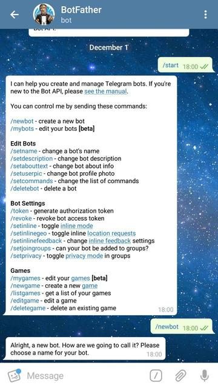

Каждый разработчик (и не только), который использует Telegram в повседневной жизни, хотя бы раз задумывался о том,
каково это - создать своего бота, на сколько это сложно и какой язык программирования лучше использовать?

## Создание нового проекта и подготовка
### 1. Добавление зависимостей в проект
Создадим новый maven-проект и отредактируем `pom.xml`, добавив в него необходимые зависимости: 
<details>
    <summary>pom.xml</summary>        
    
```xml
<?xml version="1.0" encoding="UTF-8"?>
<project xmlns="http://maven.apache.org/POM/4.0.0"
         xmlns:xsi="http://www.w3.org/2001/XMLSchema-instance"
         xsi:schemaLocation="http://maven.apache.org/POM/4.0.0 http://maven.apache.org/xsd/maven-4.0.0.xsd">
    <modelVersion>4.0.0</modelVersion>

    <groupId>io.example</groupId>
    <artifactId>anonymizerbot</artifactId>
    <version>1.0-SNAPSHOT</version>

    <build>
        <plugins>
            <plugin>
                <groupId>org.apache.maven.plugins</groupId>
                <artifactId>maven-compiler-plugin</artifactId>
                <configuration>
                    <source>8</source>
                    <target>8</target>
                </configuration>
            </plugin>
        </plugins>
    </build>

    <dependencies>

        <!-- Telegram API -->
        <dependency>
            <groupId>org.telegram</groupId>
            <artifactId>telegrambots</artifactId>
            <version>LATEST</version>
        </dependency>
        <dependency>
            <groupId>org.telegram</groupId>
            <artifactId>telegrambotsextensions</artifactId>
            <version>LATEST</version>
        </dependency>

        <!-- Log4j 2 -->
        <dependency>
            <groupId>org.apache.logging.log4j</groupId>
            <artifactId>log4j-api</artifactId>
            <version>2.11.1</version>
        </dependency>
        <dependency>
            <groupId>org.apache.logging.log4j</groupId>
            <artifactId>log4j-core</artifactId>
            <version>2.11.1</version>
        </dependency>

    </dependencies>

</project>
``` 
* `Telegram API` - [библиотека для работы с Telegram API](https://github.com/rubenlagus/TelegramBots),
    содержит в себе классы и методы для взаимодействия с сервисами Telegram и некоторые расширения
    этих классов.
* `Log4j 2` - логгер. Основные возможности `log4j2`, которые я использую, это:
    * определение своих уровней логирования и их приоритетов;
    * определение своего цвета текста для каждого уровня логирования;
    * параллельный вывод логов в консоль и файл.
</details>
    
### 2. Настройка log4j2
Хорошим тоном считается использование в проектах логгеров, а не `System.out.println()`.
Создадим новый файл с настройками `log4j2` в `src/main/java/resources` с именем `log4j2.xml`:
<details>
    <summary>log4j2.xml</summary>

```xml
<?xml version="1.0" encoding="UTF-8" ?>
<Configuration status="WARN">

    <CustomLevels>
        <CustomLevel name="STRANGE" intLevel="360"/>
        <CustomLevel name="SUCCESS" intLevel="340"/>
    </CustomLevels>

    <Appenders>
        <Console name="Console" target="SYSTEM_OUT">
            <PatternLayout pattern="%highlight{%d{HH:mm:ss} [%t] %-5level %logger{36} - %msg%n}{STRANGE_USER=bright yellow bold, SUCCESS_USER=bright green bold}"/>
        </Console>
    </Appenders>

    <Loggers>
        <Logger name="io.example.anonymizerbot" level="info" additivity="false">
            <AppenderRef ref="Console"/>
        </Logger>
    </Loggers>

    <Root>
        <Appender ref="Console"/>
    </Root>

</Configuration> 
```
Информацию о настройке и использовании `log4j2` можно найти в [официальной документации](https://logging.apache.org/log4j/2.x/).
</details>
    
### 3. Создание аккаунта для бота
Для этого нам необходимо обратиться за помощью к боту BotFather:
* найдем бота в поиске;

     </details>
* выполним команду `/start`;
* выполним команду `/newbot`;


* зададим какое-нибудь имя нашему боту (должно заканчиваться на "Bot"). Я назвал его ExampleOfAnonymizerBot.


После выполнения этих команд мы получим токен, который нам понадобится для использования Bot API.
(`749430772:AAF54VXPZeGRgFWmjCto-c8EIm7Ydk_VCW0`)
    
## Реализация
### 1. Модель анонимного отправителя сообщений

Данные, необходиме нам от кажного пользователя:
- `User mUser` - информация о пользователе Telegram;
- `Chat mChat` - информация о чате пользователя и бота;
- `String mDisplayedName` - имя, от которого `mUser` будет посылать сообщения другим пользователям бота.

<details>
    <summary>Anunymous.java</summary> 
    
```java
package io.example.anonymizerbot.model;

import org.telegram.telegrambots.meta.api.objects.User;

import java.util.HashSet;
import java.util.Objects;
import java.util.Set;
import java.util.stream.Stream;

public final class Anonymouses {

    private final Set<Anonymous> mAnonymouses;

    public Anonymouses() {
        mAnonymouses = new HashSet<>();
    }

    public boolean setUserDisplayedName(User user, String name) {

        if (isDisplayedNameTaken(name)) {
            return false;
        } else {
            mAnonymouses.stream().filter(a -> a.getUser().equals(user)).forEach(a -> a.setDisplayedName(name));
            return true;
        }
    }

    public boolean removeAnonymous(User user) {
        return mAnonymouses.removeIf(a -> a.getUser().equals(user));
    }

    public boolean addAnonymous(Anonymous anonymous) {
        return mAnonymouses.add(anonymous);
    }

    public boolean hasAnonymous(User u) {
        return mAnonymouses.stream().anyMatch(a -> a.getUser().equals(u));
    }

    public String getDisplayedName(User u) {

        Anonymous anonymous = mAnonymouses.stream().filter(a -> a.getUser().equals(u)).findFirst().orElse(null);

        if (anonymous == null) {
            return null;
        }
        return anonymous.getDisplayedName();
    }

    public Stream<Anonymous> anonymouses() {
        return mAnonymouses.stream();
    }


    private boolean isDisplayedNameTaken(String name) {
        return mAnonymouses.stream().anyMatch(a -> Objects.equals(a.getDisplayedName(), name));
    }
}
```
</details> 

### 2. Интерфейс бота

Любая кастомная команда должна наследоваться от `BotCommand` и реализовывать метод
`execute(AbsSender sender, User user, Chat chat, String[] strings)`, который исползуется для обработки команд пользователей.

После того как мы обработаем команду пользователя, мы можем послать ему ответ, используя метод `execute` класса`AbsSender`,
который принимает на вход вышеупомянутый `execute(AbsSender sender, User user, Chat chat, String[] strings)`.

Здесь и далее чтобы не оборачивать каждый раз метод `AbsSender.execute`, который может выбросить исключение `TelegramApiException`,
в `try-catch`, и для того чтобы не прописывать в каждой команде вывод однообразных логов,
создадим класс `AnonymizerCommand`, а наши кастомные комады будем уже наследовать от него (про обработку исключений в этом примере забудем):

<details>
    <summary>AnonymizerCommand.java</summary>
    
```java
package io.example.anonymizerbot.command;

import io.example.anonymizerbot.logger.LogLevel;
import io.example.anonymizerbot.logger.LogTemplate;
import org.apache.logging.log4j.Level;
import org.apache.logging.log4j.Logger;
import org.apache.logging.log4j.LogManager;
import org.telegram.telegrambots.extensions.bots.commandbot.commands.BotCommand;
import org.telegram.telegrambots.meta.api.methods.send.SendMessage;
import org.telegram.telegrambots.meta.api.objects.User;
import org.telegram.telegrambots.meta.bots.AbsSender;
import org.telegram.telegrambots.meta.exceptions.TelegramApiException;

abstract class AnonymizerCommand extends BotCommand {

    final Logger log = LogManager.getLogger(getClass());

    AnonymizerCommand(String commandIdentifier, String description) {
        super(commandIdentifier, description);
    }

    void execute(AbsSender sender, SendMessage message, User user) {
        try {
            sender.execute(message);
            log.log(Level.getLevel(LogLevel.SUCCESS), LogTemplate.COMMAND_SUCCESS, user.getId(), getCommandIdentifier());
        } catch (TelegramApiException e) {
            log.error(LogTemplate.COMMAND_EXCEPTION, user.getId(), getCommandIdentifier(), e);
        }
    }
} 
``` 
</details>

Определим команды, на которые наш бот будет реагировать:
- `/start` - создаст нового `Anonymous` без имени и добавит его в коллекию `Anonymouses`;
<details>
    <summary>StartCommand.java</summary>
    
```java
package io.example.anonymizerbot.command;

import io.example.anonymizerbot.logger.LogLevel;
import io.example.anonymizerbot.logger.LogTemplate;
import io.example.anonymizerbot.model.Anonymous;
import io.example.anonymizerbot.model.Anonymouses;
import org.apache.logging.log4j.Level;
import org.telegram.telegrambots.meta.api.methods.send.SendMessage;
import org.telegram.telegrambots.meta.api.objects.Chat;
import org.telegram.telegrambots.meta.api.objects.User;
import org.telegram.telegrambots.meta.bots.AbsSender;

public final class StartCommand extends AnonymizerCommand {

    private final Anonymouses mAnonymouses;

    public StartCommand(Anonymouses anonymouses) {
        super("start", "start using bot\n");
        mAnonymouses = anonymouses;
    }

    @Override
    public void execute(AbsSender absSender, User user, Chat chat, String[] strings) {

        log.info(LogTemplate.COMMAND_PROCESSING, user.getId(), getCommandIdentifier());

        StringBuilder sb = new StringBuilder();

        SendMessage message = new SendMessage();
        message.setChatId(chat.getId().toString());

        if (mAnonymouses.addAnonymous(new Anonymous(user, chat))) {
            log.info("User {} is trying to execute '{}' the first time. Added to users' list.", user.getId(), getCommandIdentifier());
            sb.append("Hi, ").append(user.getUserName()).append("! You've been added to bot users' list!\n")
                    .append("Please execute command:\n'/set_name <displayed_name>'\nwhere <displayed_name> is the name you want to use to hide your real name.");
        } else {
            log.log(Level.getLevel(LogLevel.STRANGE), "User {} has already executed '{}'. Is he trying to do it one more time?", user.getId(), getCommandIdentifier());
            sb.append("You've already started bot! You can send messages if you set your name (/set_name).");
        }

        message.setText(sb.toString());
        execute(absSender, message, user);
    }
}


``` 
</details> 

- `/help` - 
- `/set_name` - 
- `/my_name` - 
- `/stop` - 


